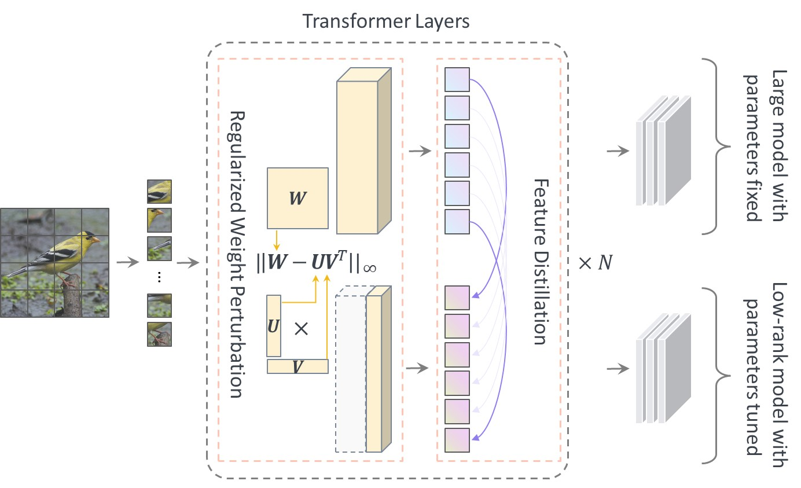

# PELA
PELA: Learning Parameter-Efficient Models with Low-Rank Approximation

#### Code contribution: Yangyang Guo ALBEF and Guangzhi Wang DeiT and Swin.

#### Detailed configuration of each model can be found on each model directory.

<div style="text-align:center">
  
</div>


### Acknowledgement
If you found this repo helpful, please consider cite the following paper:
```python
@misc{pela,
      title={PELA: Learning Parameter-Efficient Models with Low-Rank Approximation}, 
      author={Yangyang Guo and Guangzhi Wang and Mohan Kankanhalli},
      year={2023},
      eprint={2310.10700},
}
```

